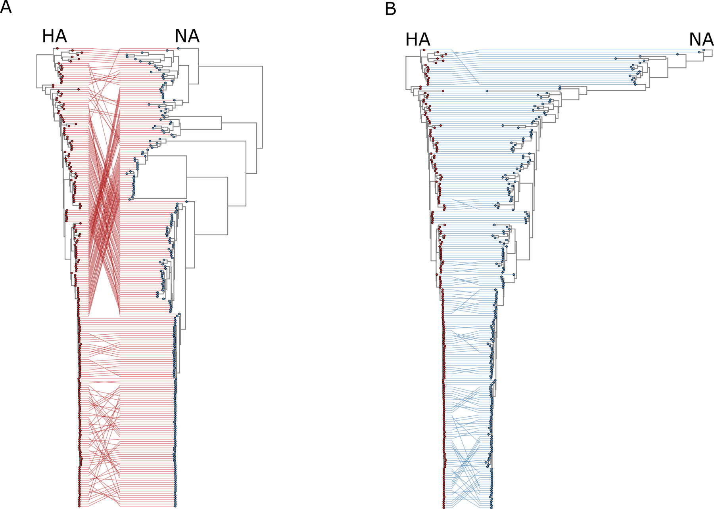

# Viral evolution and genomic epidemiology

My research investigates the evolutionary dynamics of viruses and how genetic variation shapes viral adaptation, transmission, and emergence. By integrating phylogenetic methods, genomic epidemiology, and large-scale sequencing data, I aim to understand how viral populations diversify over time and across geographic regions, providing insights into the spread and evolution of emerging pathogens.

{width=100%}

## RNA virus genomics

RNA viruses evolve rapidly and generate remarkable genetic diversity. My work focuses on characterizing the genomic architecture, mutation patterns, and evolutionary trajectories of RNA viruses using comparative genomics and phylogenetic analyses. These approaches help reveal mechanisms underlying viral adaptation, host switching, and the emergence of novel viral lineages.

## Metagenomics and microbiome analysis

Metagenomic approaches allow the exploration of microbial and viral diversity directly from environmental samples. I apply high-throughput sequencing and bioinformatic pipelines to characterize microbiomes and viromes across diverse ecosystems. This research helps uncover hidden microbial diversity and provides insights into microbial community structure, function, and ecological interactions.

## Microbial ecology in extreme environments

Extreme environments such as deserts, hydrothermal systems, and hypersaline habitats host unique microbial communities adapted to harsh conditions. My research explores how microbial and viral communities evolve and interact in these ecosystems, combining metagenomics, ecological analysis, and comparative genomics to understand the mechanisms of adaptation and survival.

## Bioinformatics and computational genomics

Modern genomics requires powerful computational approaches to analyze large biological datasets. I develop and apply bioinformatic tools for genome analysis, phylogenetics, metagenomics, and evolutionary modeling. These methods enable the discovery of novel genes, viral diversity, and evolutionary patterns across microbial and viral genomes.

